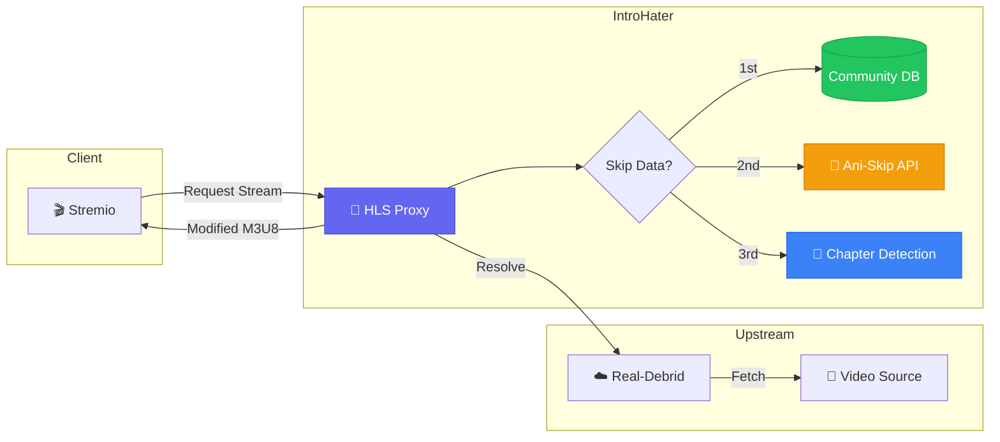

<div align="center">

<!-- Premium Animated Header -->
<picture>
  <source media="(prefers-color-scheme: dark)" srcset="docs/icon.svg">
  <source media="(prefers-color-scheme: light)" srcset="docs/icon.svg">
  
</picture>

# ✨ IntroHater

### **The Ultimate Skip Intro Addon for Stremio**

##### *Skip the Boring. Focus on the Story.*

<br/>

<!-- Premium Badge Collection -->
[](https://github.com/introhaterapp/IntroHater/releases)
[](https://stremio.com)
[](LICENSE)

[](https://github.com/introhaterapp/IntroHater)
[](https://hub.docker.com)
[](https://nodejs.org)

<br/>

<!-- Live Stats Badges -->
<a href="https://introhater.com">
  
</a>
<a href="https://introhater.com/catalog.html">
  
</a>

<br/><br/>

<!-- Quick Links -->
<p>
  <a href="https://introhater.com"><b>🌐 Website</b></a> •
  <a href="https://introhater.com/catalog.html"><b>📚 Catalog</b></a> •
  <a href="https://introhater.com/api.html"><b>📖 API Docs</b></a> •
  <a href="https://introhater.com/leaderboard.html"><b>🏆 Leaderboard</b></a> •
  <a href="https://introhater.com/community.html"><b>👥 Community</b></a>
</p>

<br/>

---

<br/>

<!-- Showcase Animation GIF Placeholder -->


*Experience seamless intro skipping across all your devices*

<br/>

</div>

---

## 🎯 What is IntroHater?

**IntroHater** is a next-generation Stremio addon that **automatically skips intros, outros, and recaps** for movies and TV shows. Unlike basic seeking scripts, IntroHater employs **Smart HLS Proxying** to surgically modify video streams on-the-fly — physically removing unwanted segments before they ever reach your player.

<div align="center">

| 🚀 **Instant** | 🧠 **Intelligent** | 🔒 **Private** |
|:-:|:-:|:-:|
| Zero-delay segment removal with pre-fetched data | Multi-source skip detection with fallback logic | Open source, no tracking, your data stays yours |

</div>

---

## ⚡ Key Features

<table>
<tr>
<td width="50%">

### 🎬 Smart HLS Proxy Engine
Our proprietary HLS proxy converts streams and stitches content in real-time to skip intros **seamlessly** — no buffering, no glitches, just pure content.

</td>
<td width="50%">

### 🧠 Multi-Source Skip Detection
```
Priority: Community DB → Ani-Skip → Chapter Detection
```
Three-tier fallback system ensures skip data for virtually any content.

</td>
</tr>
<tr>
<td width="50%">

### 📺 Universal Compatibility
Works flawlessly across:
- **TV**: Android TV, Samsung Tizen, LG WebOS
- **Mobile**: iOS & Android (VLC/Outplayer)
- **Desktop**: Windows, macOS, Linux

</td>
<td width="50%">

### 🔗 Real-Debrid Integration
Premium streaming through Real-Debrid ensures high-quality, unrestricted content delivery with your existing subscription.

</td>
</tr>
<tr>
<td width="50%">

### 👥 Community-Powered Database
Users contribute skip segments, building an ever-growing library. Your contributions help millions skip intros.

</td>
<td width="50%">

### 🏆 Gamified Leaderboard
Track your contributions, earn ranks, and compete with the community. Every segment submitted counts!

</td>
</tr>
</table>

---

## 🧬 Architecture

<div align="center">



</div>

### How It Works

1. **📥 Intercept** — Stremio requests a stream from IntroHater
2. **🔍 Resolve** — IntroHater resolves the content via Real-Debrid
3. **🧠 Analyze** — Checks Community DB → Ani-Skip → Video Chapters for skip timestamps
4. **✂️ Proxy** — Generates a modified `.m3u8` playlist that jumps from `0:00 → IntroStart` then `IntroEnd → Finish`

---

## 🔌 Skip Data Sources

<div align="center">

| Source | Coverage | Description |
|:------:|:--------:|:------------|
| 📚 **Community Database** | Growing Daily | User-submitted skip segments with voting and verification |
| 🎌 **Ani-Skip Integration** | **150,000+** Episodes | Massive anime skip database covering most popular series |
| 📼 **Chapter Detection** | Automatic | FFprobe analysis of embedded video chapters (fallback) |

</div>

---

## 🚀 Quick Start

### For Users

**One-click installation** — no technical setup required:

<div align="center">

[](https://introhater.com/configure.html)

</div>

Simply visit **[introhater.com](https://introhater.com)** → Configure your settings → Install to Stremio

---

### For Developers

<details>
<summary><b>📦 Local Development Setup</b></summary>
<br/>

#### Prerequisites

- **Node.js** 18+ 
- **MongoDB** (local or Atlas)
- **FFmpeg** (auto-installed on first run for Windows)

#### Installation

```bash
# Clone the repository
git clone https://github.com/introhaterapp/IntroHater.git
cd IntroHater

# Install dependencies
npm install

# Configure environment
cp .env.example .env
# Edit .env with your settings
```

#### Environment Variables

```env
# Required
MONGODB_URI=mongodb://localhost:27017/introhater

# Optional
OMDB_API_KEY=your_omdb_key      # For poster fetching
ADMIN_PASSWORD=your_admin_pwd    # For admin panel access
PORT=7005                        # Default: 7005
```

#### Run

```bash
# Development
npm start

# Server runs at http://localhost:7005
```

</details>

<details>
<summary><b>🐳 Docker Deployment</b></summary>
<br/>

#### Quick Start with Docker Compose (Recommended)

The easiest way to run IntroHater locally with MongoDB:

```bash
# Start everything (MongoDB + IntroHater)
docker-compose up -d

# View logs
docker-compose logs -f introhater

# Stop
docker-compose down
```

The app will be available at `http://localhost:7005`

#### Manual Docker Build

```bash
# Build
docker build -t introhater .

# Run
docker run -d \
  -p 7005:7005 \
  -e MONGODB_URI=mongodb://host.docker.internal:27017/introhater \
  --name introhater \
  introhater
```

Or use `render.yaml` for one-click deployment to Render.com.

</details>

<details>
<summary><b>☁️ Cloud Deployment (Render/Railway)</b></summary>
<br/>

The repository includes a `render.yaml` for easy deployment:

1. Fork this repository
2. Connect to [Render.com](https://render.com) or [Railway.app](https://railway.app)
3. Set environment variables
4. Deploy!

</details>

---

## 📡 API Reference

IntroHater exposes a RESTful API for integration and data access.

<div align="center">

| Endpoint | Method | Description |
|:---------|:------:|:------------|
| `/api/stats` | `GET` | Global statistics (users, segments, time saved) |
| `/api/leaderboard` | `GET` | Top contributors ranking |
| `/api/catalog` | `GET` | Searchable skip segment catalog |
| `/api/activity` | `GET` | Live feed of recent contributions |
| `/api/skip/:videoId` | `GET` | Get skip segments for a specific video |

</div>

Full API documentation: **[introhater.com/api.html](https://introhater.com/api.html)**

---

## 📊 Project Stats

<div align="center">

| Metric | Value |
|:------:|:-----:|
| **Active Users** | Growing Community |
| **Skip Segments** | 150,000+ |
| **Supported Shows** | Thousands |
| **Time Saved** | Counting... |

</div>

---

## 🛠️ Tech Stack

<div align="center">


</div>

- **Backend**: Node.js + Express
- **Database**: MongoDB (with optimized indexes)
- **Media Processing**: FFmpeg / FFprobe
- **Stremio SDK**: Official `stremio-addon-sdk`
- **Security**: Helmet, HPP, Rate Limiting, XSS Protection

---

## 🤝 Contributing

We welcome contributions from the community! Here's how you can help:

1. **🐛 Report Bugs** — Open an issue with detailed reproduction steps
2. **💡 Suggest Features** — Share your ideas for improvements
3. **📝 Submit Skip Segments** — Use the Community Portal to add missing data
4. **🔧 Code Contributions** — Fork, develop, and submit a PR

<div align="center">

[](docs/CONTRIBUTING.md)

</div>

---

## 📜 License

<div align="center">

**MIT License** — Free and open source, forever.

Made with ❤️ by the **IntroHater Community**

---

<br/>

<a href="https://introhater.com">
  
</a>

<br/><br/>

**⭐ Star this repo if IntroHater saves you time!**

</div>
